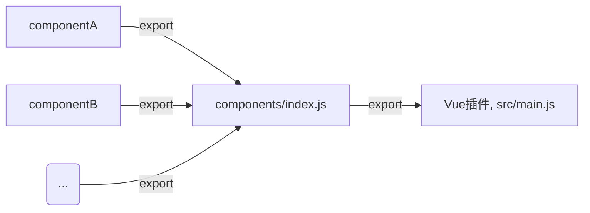

这篇文章，将逐步介绍如何搭建Vue组件库的项目结构，提供一个高效的开发环境

<!-- more -->

## 1. 项目结构
我们并不打算一开始就使用 Vue CLI3 去构建项目，而是希望专注到组件开发上，不过到后面会使用到，所以现阶段会使用到 [parcel](https://parceljs.org/), 一款极速零配置的web打包工具。

首先，在 [github](https://github.com/) 创建仓库 [litchi-ui](https://github.com/Yangjia23/litchi-ui), 然后 clone 到本地

项目初始化，引入 Vue、parcel 等

```linux
cd litchi-ui
yarn init -y
yarn add vue
yarn add dev parcel-bundler
```

接下来，将构建项目目录结构了，在根目录下新建 `index.html`文件，`src`(源代码),`test`(测试),`docs`(文档) 等目录

```html
<!-- index.html -->
<!DOCTYPE html>
<html lang="zh-Hans">
<head>
    <meta charset="UTF-8" />
    <meta name="viewport" content="width=device-width, initial-scale=1.0" />
    <meta http-equiv="X-UA-Compatible" content="ie=edge" />
    <title>litchi-ui</title>
</head>

<body>
    <div id="app">
    </div>
    <script src="./src/app.js"></script>
</body>

</html>
```

在 `src` 目录下，将创建 `app.js`,实例化一个 Vue 实例，加载使用我们将要开发的组件，最终挂载到页面中

```javascript
// app.js
import Vue from 'vue';

new Vue({
    el: '#app',
    render () {
        return <h1>Hello Litchi</h1>
    }
})

// 或
// new Vue().$mount('#app') // 手动挂载
```

## 2. 组件结构
在 `src` 目录下，创建 `component`文件夹，存放所有的组件，而每个组件又是一个单独的文件夹，以`button` 组件为例，目录结构如下


- `index.js` : 导入组件，并最终导出
  
  ```js
  import Button from './lc-button.vue'
  export default Button
  ```

- `lc-button.vue`: 单文件组件
  ```html
  <template>
    <button>
        <slot></slot>
    </button>
  </template>
  <script>
    export default {
        name: 'LcButton'
    }
  </script>
  ```


现在，就 `src/app.js` 中引入 `button` 组件使用了

```js
// app.js
import Button from './components/button'

Vue.component('lc-button', Button)

new Vue({
    el: '#app',
    render () {
        return <lc-button>确定</lc-button>
    }
})

```

这样，就注册了一个全局组件 `lc-button`, 如何看到页面是否正确展示出 `button` 呢？
接下来，`parcel` 登场了, 在 `package.json` 中添加

```json
"scripts": {
    "dev": "parcel index.html --no-cache",
},
```
终端运行 `npm run dev` 命令就可以看到页面正确显示一个 button 了

## 3. 组件合并到 Vue.js 插件中
上面介绍的是直接在 `app.js`文件中引入`Button`,注册成全局组件后使用，当组件越来越多了，每个都单独引入，再注册，会产生很多冗余代码，不善管理。此时就需要集中管理啦。

平常在使用像 `Element` 时，常见做法是 

```js
import Element fron 'element';

Vue.use(Element)
```
通过`Vue.use(Element)` 我们就可以使用`Element`中的所有组件，`Vue.use` 文档如下：

> [Vue.use(plugin)](https://cn.vuejs.org/v2/api/#Vue-use)
> 
> 安装 Vue.js 插件。如果插件是一个对象，必须提供 install 方法。如果插件是一个函数，它会被作为 install 方法。install 方法调用时，会将 Vue 作为参数传入。
> 
>该方法需要在调用 new Vue() 之前被调用。
>
> 当 install 方法被同一个插件多次调用，插件将只会被安装一次

我们的UI库想实现通过 `Vue.use(Litchi-UI)`,可以使用所有组件， 就需要导出一个存在 `install` 方法的对象，所有，在 `src`
目录下，新建 `main.js`

```js
const componentLibary = {
    install () {
        // ...
    }
}
export defaault componentLibary
```

接着，需要在 `main.js` 中引入所有组件，并在 `install` 方法中，注册成全局组件

我们在`src/components` 下新建 `index.js`, 作为所有组件的导出口，不需要在 `main.js` 中一个一个引入

```js
// src/components/index.js
export {default as Button} from './button';
```

所以，组件的导入导出流程如下



接着，就需要在 `main.js` 的`install` 中将所有组件注册

```js
import * as components from './components'

const ComponentLibary = {
    install(Vue, opts = {}) {
        for(const componentName in components) {
            const component = components[componentName]
            Vue.component(component.name, component)
        }
    }
}

export default ComponentLibary

if (typeof window !== 'undefined' && window.Vue) {
    window.Vue.use(ComponentLibary)
}

```

至此，整个开发环境算是OK了，之后，就只需要专注于组件的开发工作了


